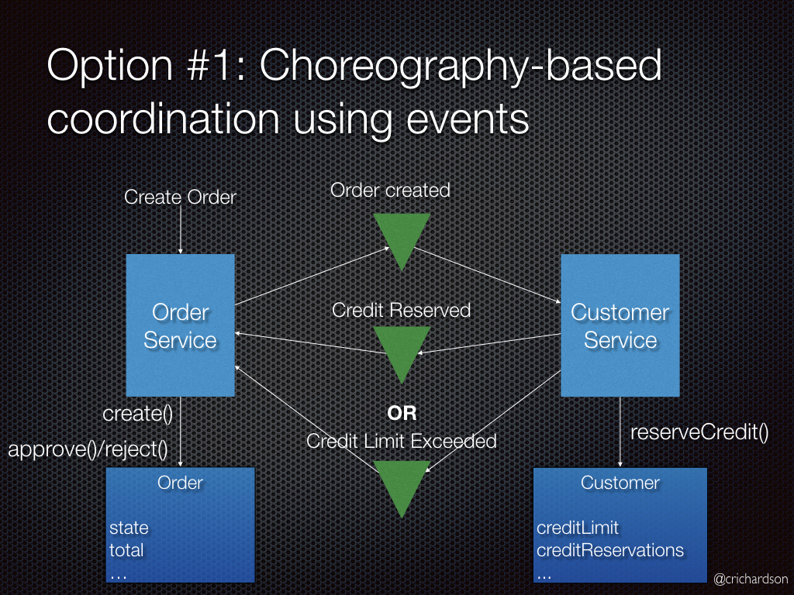
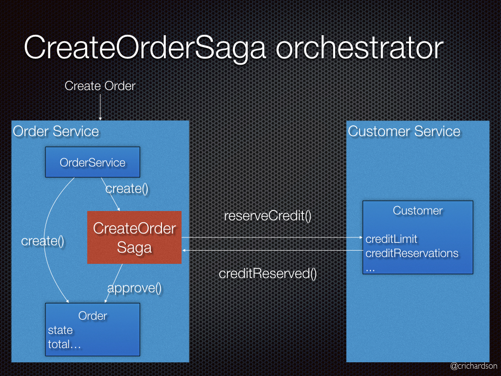
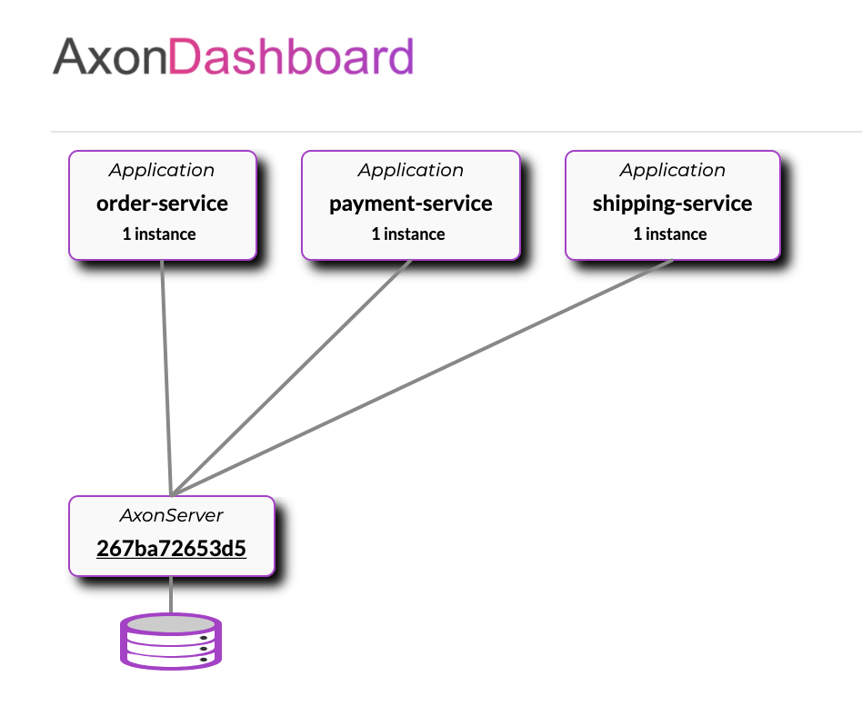
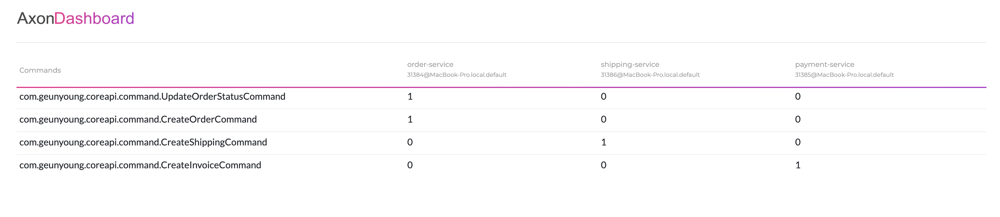

# axon-saga-practice

spring boot와 axon framework 환경에서 SAGA pattern을 활용해 분산 트랜잭션을 구현해보는 실습 코드입니다.

## MSA에서의 transaction

모든 아키텍쳐가 그러하듯 MSA에서도 단점과 한계들이 존재하는데, 그 중 하나는 일련의 db access 작업에 대해 atomicity를 보장할 수 없다는 것이다. 기존의 monolithic 아키텍처에서는 모든 코드가 물리적으로 같은 공간에 있었기 때문에 spring framework의 도움을 받으면 `@Transactional` annotation 등을 사용해 트랜잭션 기능을 손쉽게 활용할 수 있었다. 하지만 MSA에서는 물리적으로 분리된 여러 마이크로서비스들이 독립적으로 존재하기 때문에 각각의 마이크로서비스에서 발생하는 db access 작업을 하나의 트랜잭션으로 묶기 위해서는 추가적인 고민이 필요하다.

## SAGA pattern

그러한 분산 환경에서의 트랜잭션을 구현하는 방법으로 SAGA Pattern이라는 것이 있다. SAGA pattern이란 마이크로서비스들끼리 이벤트를 주고받아 특정 마이크로서비스에서의 작업이 실패하면 이전까지 작업이 완료된 마이크로서비스들에게 보상 (complementary) 이베트를 소싱함으로써 분산 환경에서 atomicity를 보장하는 패턴이다. SAGA pattern에서의 핵심은 마이크로서비스들끼리 이벤트를 주고 받는다는 것이기 때문에, 이 패턴은 기본적으로 event sourcing 패턴 위에 적용되는 패턴이다. event sourcing 및 CQRS 패턴에 대한 실습 코드는 [여기](https://github.com/BaekGeunYoung/cqrs-eventsourcing-practice) 를 참조하면 된다.

SAGA pattern은 구체적으로 두 가지 종류가 있는데, 하나는 Choreography based SAGA pattern이고, 다른 하나는 Orchestration based SAGA pattern이다.

### Choreography Based SAGA



이 패턴은 각각의 로컬 트랜잭션이 다른 마이크로서비스로 이벤트를 소싱하는 방식이다. 이 방식의 장단점은 아래와 같다.

장점
- 이해하기 쉽고 간단하다.
- 구축하기 쉽다.

단점
- 어떤 서비스가 어떤 이벤트를 수신하는지 추측하기 어렵다.
- 트랜잭션이 많은 서비스를 거쳐야 할 때 상태를 인지하기 어렵다.
- 모든 서비스는 호출되는 각 서비스의 이벤트를 리슨해야 한다.

### Orchestration Based SAGA



이 패턴은 분산 트랜잭션을 관리하는 orchestrator가 존재하여, 이 orchestrator가 중앙에서 여러 로컬 트랜잭션을 관리하는 형태이다. 이 패턴의 장단점은 아래와 같다.

장점
- 서비스간의 종속성이 없고 Orchestrator가 호출하기 때문에 분산트랜잭션의 중앙 집중화가 된다.
- 서비스의 복잡성이 줄어든다.
- 구현 및 테스트가 쉽다.
- 롤백을 쉽게 관리할 수 있다.

단점
- 모든 트랜잭션을 Orchestrator가 관리하기 때문에 로직이 복잡해 질 수 있다.
- Orchestrator라는 추가 서비스가 들어가고 이를 관리해애하여 인프라의 복잡성이 증가된다.

본 실습에서는 orchestration based SAGA pattern을 이용해 분산 트랜잭션을 구현해보려고 한다.

## package structure

```
.
├── core-api
├── order-services
├── payment-service
└── shipping-service
```

SAGA pattern을 구현하기 위해서는 여러 마이크로서비스가 동일한 event 및 command 객체를 사용해야 하기 때문에 multi project 방식으로 프로젝트를 만들었고, 공통으로 사용하는 event와 command 객체는 core-api 모듈에 위치시켰다. 실제로 MSA를 프로덕션 환경에서 서비스하기 위해서는 각 마이크로서비스 간에 물리적인 종속성이 없어야 하기 때문에 core-api와 같은 모듈은 라이브러리화하거나 git submodule로 관리하는게 좋을 것이다.

## distributed transaction flow

상품을 주문하는 요청을 다음 단계에 따라 나누어 처리하도록 한다.

1. 주문 모델 생성
2. 결제 모델 생성
3. 배송 모델 생성
4. 배송이 완료된 후 배송 모델의 상태 변경

1번 작업은 order service에서, 2번 작업은 payment service에서, 3,4번 작업은 shipping service에서 처리하면 될 것이다.

## Saga class

위에서 설명했듯이 orchestration based pattern에서는 로컬 트랜잭션을 중앙에서 관리하는 orchestrator가 존재한다. 이 orchestrator는 각 마이크로서비스에서 발생하는 이벤트를 리스닝해 다음에 발생할 적절한 커맨드를 command gateway를 통해 넘겨준다. 이 command gateway는 axon server에 등록된 서비스들 간에 command를 주고받는 통로 역할을 한다.

```kotlin
@Saga
class OrderManagementSaga() {
    @Autowired
    @Transient
    private lateinit var commandGateway: CommandGateway

    @StartSaga
    @SagaEventHandler(associationProperty = "orderId")
    fun handle(orderCreatedEvent: OrderCreatedEvent) {
        val paymentId = UUID.randomUUID().toString()
        println("Saga invoked")

        //associate Saga
        SagaLifecycle.associateWith("paymentId", paymentId)
        println("order id" + orderCreatedEvent.orderId)

        //send the commands
        commandGateway.send<CreateInvoiceCommand>(CreateInvoiceCommand(paymentId, orderCreatedEvent.orderId))
    }

    @SagaEventHandler(associationProperty = "paymentId")
    fun handle(invoiceCreatedEvent: InvoiceCreatedEvent) {
        val shippingId = UUID.randomUUID().toString()
        println("Saga continued")

        //associate Saga with shipping
        SagaLifecycle.associateWith("shipping", shippingId)

        //send the create shipping command
        commandGateway.send<CreateShippingCommand>(CreateShippingCommand(shippingId, invoiceCreatedEvent.orderId, invoiceCreatedEvent.paymentId))
    }

    @SagaEventHandler(associationProperty = "orderId")
    fun handle(orderShippedEvent: OrderShippedEvent) {
        commandGateway.send<UpdateOrderStatusCommand>(UpdateOrderStatusCommand(orderShippedEvent.orderId, "SHIPPED"))
    }

    @SagaEventHandler(associationProperty = "orderId")
    fun handle(orderUpdatedEvent: OrderUpdatedEvent?) {
        SagaLifecycle.end()
    }
}
```

## axon server

axon framework를 이용해 SAGA pattern을 구현하기 위해서는 axon server를 구동해야 한다. docker를 이용해 간단히 구동할 수 있고, 8024번 포트로 접속하면 대시보드를 볼 수 있다.

`docker run -d --name axon-server -p 8024:8024 -p 8124:8124 axoniq/axonserver`

각각의 마이크로서비스를 구동한 뒤 axon 대시보드를 확인해보면 아래와 같이 세 개의 서비스가 axon server에 등록된 것을 확인할 수 있다.



그리고 적절하게 request를 날리고 난 후 아래처럼 어떤 커맨드가 몇 번 실행되었는지 확인해볼 수 있다.



처음에 계획했던 대로 order service와 payment service에서 각각 한 번, shipping service에서 두 번의 커맨드가 실행되었음을 확인할 수 있다.

## 정리

spring boot와 axon framework를 이용해 orchestration based SAGA pattern을 통한 분산 트랜잭션을 구현해보았다. MSA 구조에 대한 이해도를 한 층 높일 수 있었고, 분산 환경 및 대규모 아키텍처에 좀 더 많은 관심을 갖게 된 계기가 된 것 같다. 추가로 본 실습에서는 장애 발생 시 보상 트랜잭션을 발생시키는 부분이 구현되어있지 않은데, 이 부분도 추가로 구현해보면 좋을 것 같다.
